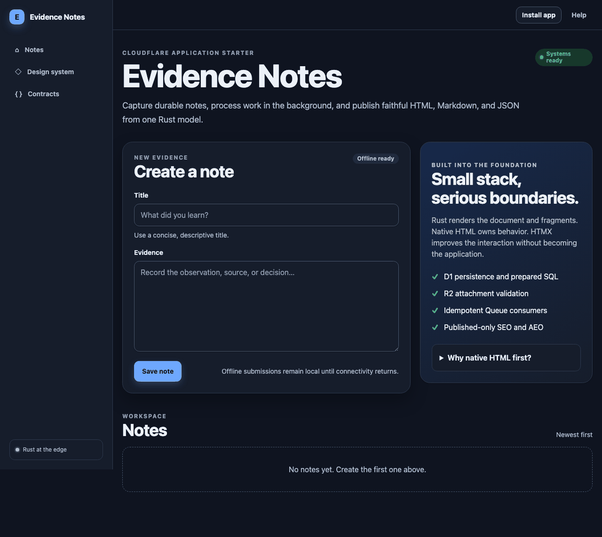
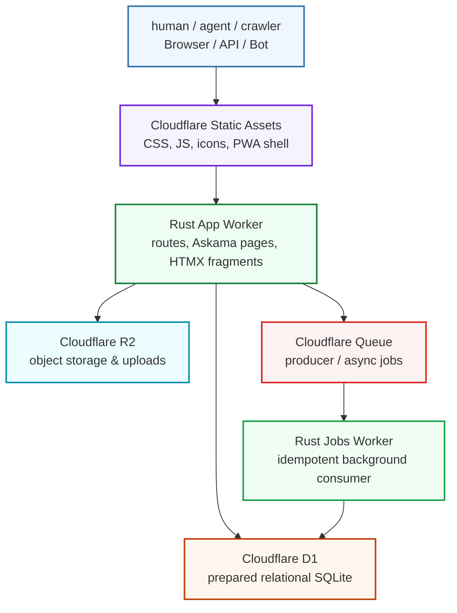

# Rust + HTMX Cloudflare Starter

[](https://github.com/anishk123/cloudflare-rust-htmx-starter/actions/workflows/ci.yml)
[](https://github.com/anishk123/cloudflare-rust-htmx-starter/actions/workflows/security.yml)


Build polished, progressively enhanced Cloudflare applications in Rust—without a frontend build pipeline.

This starter gives humans and coding agents the same clear path from first run to production-minded contribution: ordinary external HTML templates, focused Rust modules, native browser behavior, one command surface, and boundaries that stay visible as the product grows.



## What you get

| Need | Included foundation |
|---|---|
| Fast first render | Server-rendered Askama HTML, no hydration, no web font, tiny enforced CSS/JS budgets |
| Product-ready UI | Starter-owned responsive design system, dark mode, reduced motion, accessible native controls |
| Durable data | D1 repositories with prepared SQL and versioned Serde/Schemars contracts |
| Background work | Idempotent Cloudflare Queue consumer in a separate Rust Worker |
| Files and artifacts | R2 upload boundary with size, quota, type and magic-byte validation |
| Public discovery | Canonical HTML, Markdown, JSON, JSON-LD, sitemap, robots and `llms.txt` |
| Offline resilience | Conservative shell cache and IndexedDB mutation outbox with fresh CSRF replay |
| Repeatable development | Rust `xtask` commands for bootstrap, local development, testing, generation and deployment |

### A good fit when

- you want server-owned HTML and product logic with modest browser JavaScript;
- SEO, answer-engine discovery, first render and progressive enhancement matter;
- Cloudflare D1, R2 and Queues fit your infrastructure;
- you want a compact foundation that humans and agents can understand end to end.

### Choose something else when

- the product is primarily a highly interactive offline canvas or game;
- your team requires a client-side component ecosystem or an npm application build;
- you need infrastructure or database portability to be the primary constraint today.

## Five-minute start

You need [Rust and rustup](https://rustup.rs/) plus Node.js 22 or newer so Wrangler can run. Node is tooling only: there is no `package.json`, bundler, CSS compiler, or Node application runtime.

### 1. Clone and run

```bash
git clone https://github.com/anishk123/cloudflare-rust-htmx-starter.git my-app
cd my-app
cargo xtask dev
```

Open `http://localhost:8787`. The first run checks prerequisites, installs the Rust Wasm target and pinned Wrangler toolchain when needed, vendors browser assets, applies local migrations, and starts the app and jobs Workers. No Cloudflare account is required for local development.

### 2. Make it yours

```bash
cargo xtask configure my-app \
  --title "My App" \
  --github my-org/my-app
```

Your most common edit points are intentionally ordinary:

- HTML: `crates/templates/templates/`
- typed template data: `crates/templates/src/`
- colors, spacing and components: `public/assets/app.css`
- HTTP coordination: `workers/app/src/routes/`
- business rules: `crates/domain/`
- durable contracts: `crates/contracts/`

Open `http://localhost:8787/design-system` while changing the UI.

### 3. Verify

```bash
cargo xtask verify
```

That one command runs formatting, Clippy, native tests, Wasm checks, release builds, structural rules, generator smoke, browser syntax checks and the local D1/Queue/publication flow.

## Choose your path

| I want to… | Start here |
|---|---|
| Understand local state and common setup problems | [Local development](docs/LOCAL_DEVELOPMENT.md) |
| Add my first product capability | [Extending the starter](docs/EXTENDING.md) |
| Change pages, fragments or the visual language | [External templates](docs/EXTENDING.md#templates-and-ui) and `/design-system` |
| Understand request, data, cache and offline flow | [Architecture](docs/ARCHITECTURE.md) |
| Evolve an API, Queue or offline payload | [Contracts](docs/CONTRACTS.md) |
| Add real users or tenant data | [Authentication boundary](docs/AUTH.md) |
| Review security and secret handling | [Security architecture](docs/SECURITY.md) and [secrets](docs/SECRETS.md) |
| Learn every supported command | [Command reference](docs/COMMANDS.md) |
| Provision and deploy deliberately | [Deployment](docs/DEPLOYMENT.md) |
| Make a review-friendly contribution | [Contributing](CONTRIBUTING.md) |
| Give a coding agent the project contract | [AGENTS.md](AGENTS.md) |

## From Evidence Notes to your product

The included application is a small vertical slice, not a toy homepage. Each part demonstrates a reusable production pattern:

| Demo behavior | Product pattern |
|---|---|
| Create a note | validated form → versioned request → domain rule → prepared D1 write |
| Queue a summary | small ID-only message → idempotent at-least-once consumer → D1 update |
| Upload an attachment | owner-scoped R2 key → type/signature/size/quota checks |
| Publish a note | explicit draft/public boundary → canonical HTML, Markdown and JSON |
| Work through a weak connection | server-rendered shell → conservative static cache → replayable mutation ID |
| Discover content | semantic HTML → metadata/JSON-LD → sitemap, robots and `llms.txt` |

Replace Evidence Notes feature by feature; keep the architecture boundaries and verification loop.

## How the pieces fit




Cloudflare Static Assets serves browser files ahead of Rust. The app Worker owns HTTP, authentication context, response policy and product coordination. Domain, database and template crates stay independently understandable. Background work is separate only because retries and at-least-once delivery are genuinely different concerns.

Read [Architecture](docs/ARCHITECTURE.md) when you want the full request, cache and offline boundaries.

## Deliberate technology choices

| Layer | Choice | Why it is here |
|---|---|---|
| Runtime | Cloudflare Workers | global serverless execution and local `workerd` simulation |
| Application | Rust → Wasm | strong types, compact runtime artifacts, one backend/tooling language |
| HTML | Askama 0.16 | external `.html` files, compile-time checks and escaping by default |
| Interaction | HTMX 2.0.10 | partial HTML updates without hydration or duplicated client state |
| UI | starter-owned CSS | explicit tokens/layers, approachable overrides, no framework contract to fight |
| Data | D1 + prepared SQL | Cloudflare-native relational state without a Wasm ORM |
| Objects | R2 | uploads and large artifacts stay outside relational rows |
| Async | Cloudflare Queues | retries, batching and a dead-letter queue |
| Contracts | Serde + Schemars | validated Rust shapes plus machine-readable JSON Schema |
| Automation | Rust `xtask` | one discoverable command surface for people and agents |

Browser code is limited to vendored HTMX/response-targets plus starter-owned `app.css`, `app.js` and `sw.js`. Native HTML owns links, forms, validation, disclosure and other behavior before custom JavaScript is considered.

## Create a new application

Generate a clean project without the starter’s Git history or Cloudflare resource IDs:

```bash
cargo xtask new my-product \
  --title "My Product" \
  --dir ../my-product \
  --github my-org/my-product

cd ../my-product
cargo xtask dev
```

The generator rewrites application/resource names, visible branding, PWA identifiers and CI badges. It excludes credentials, build output and local Wrangler state, then resets D1 IDs so a generated app cannot accidentally address the source project’s database.

## Performance and caching contract

The fast path has no hydration, web font, runtime CDN or application bundle. Structural checks currently enforce uncompressed limits of 24 KiB for starter-owned CSS and 8 KiB for starter-owned JavaScript. Versioned vendor assets are immutable; starter assets revalidate; published data uses explicit browser and edge freshness; private, mutation, CSRF and negative responses are `Cache-Control: no-store`.

Those defaults make the rendering workload small even on modest devices. They are not a promise about every future application: production Core Web Vitals still depend on content, images, D1 latency and third-party code. `.github/lighthouse/budgets.json` records targets for teams that add deployed Lighthouse or field monitoring.

## Security and data boundaries

The demo is intentionally unauthenticated, but its data access is owner-scoped behind a development identity. Before storing real user or workspace data, choose and enforce an authentication/session model. `no-store` is caching policy, not authorization.

The starter also includes fail-closed double-submit CSRF, prepared SQL, explicit draft/public state, rate limits, validated uploads, idempotent jobs/replay, restrictive CSP, safe JSON-LD serialization, and separation between Cloudflare control-plane credentials and Worker runtime secrets.

Start with [Authentication](docs/AUTH.md), [Security](docs/SECURITY.md), and [Secrets](docs/SECRETS.md) before adding sensitive data, payments or tenant access.

## Testing and CI

```bash
cargo xtask test    # native unit and policy tests
cargo xtask e2e     # local D1 + Queue + publish/discovery smoke
cargo xtask check   # structural starter contracts
cargo xtask smoke   # generated-project contract
cargo xtask verify  # complete local gate
```

GitHub Actions repeats formatting, Clippy, tests, Wasm checks, release builds, e2e, generator and browser syntax checks. Security workflows add `cargo audit`, dependency review and Dependabot. Ordinary pushes and pull requests never deploy Cloudflare resources.

## Deploy when you are ready

Use a narrowly scoped Cloudflare API token with account-level **Edit** permissions for **Workers Scripts**, **D1**, **Workers R2 Storage**, and **Queues**. Keep control-plane credentials out of `.dev.vars` and Worker bindings.

```bash
export CLOUDFLARE_API_TOKEN="..."
export CLOUDFLARE_ACCOUNT_ID="..."

cargo xtask whoami
cargo xtask deploy
```

`deploy` verifies locally, provisions or reuses resources, applies migrations, deploys the jobs Worker, then deploys the app Worker. Read [Deployment](docs/DEPLOYMENT.md) before the first remote mutation.

## Repository map

```text
workers/app/          small route table plus focused auth/http/route modules
workers/jobs/         idempotent Queue consumer
crates/contracts/     versioned Serde/Schemars boundaries
crates/domain/        framework-independent business rules
crates/database/      prepared D1 SQL repositories
crates/templates/     typed view models and external Askama HTML
crates/observability/ structured events and request/job correlation
crates/shared/        dependency-light shared helpers
crates/xtask/         developer, generator and deployment automation
public/assets/        design system, browser code and versioned vendor assets
public/sw.js          conservative app-shell service worker
public/offline.html   static credential-free offline fallback
migrations/           D1 schema evolution
docs/                 focused learning and production guides
```

## Contributing—human or agent

Humans and coding agents use the same loop:

```text
read → choose the right boundary → failing test → focused implementation
→ canonical verification → reviewable pull request
```

Read [CONTRIBUTING.md](CONTRIBUTING.md) for the first contribution and [AGENTS.md](AGENTS.md) for the authoritative architecture/command contract. Tool-specific files point back to those sources so guidance does not drift.

## Third-party assets and license

Pinned browser assets are served from this application origin, so production has no browser-time third-party CDN dependency. See [THIRD_PARTY_NOTICES.md](THIRD_PARTY_NOTICES.md).

MIT licensed.
