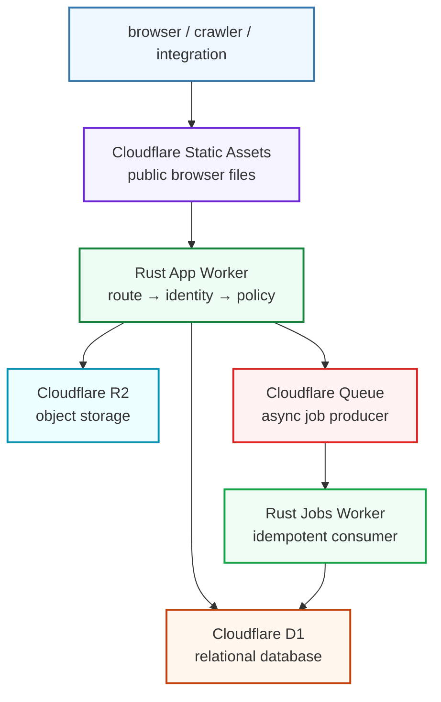
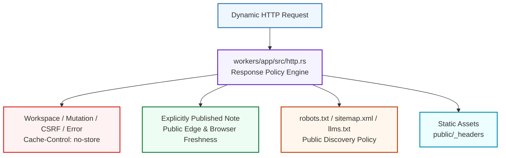

# Architecture

The starter is intentionally small enough to understand end to end. Boundaries follow differences in responsibility, failure mode and data lifetime—not fashionable layers.

## Request flow




Cloudflare Static Assets serves `public/` before the application Worker. Versioned vendor files are immutable. Starter CSS/JavaScript and the credential-free offline shell use revalidation.

The app Worker handles page, fragment, data and system routes. The separate jobs Worker exists because Queue retries and at-least-once delivery are genuinely different from request/response semantics.

## Responsibility map

| Boundary | Owns | Must not own |
|---|---|---|
| `crates/contracts` | durable/versioned cross-boundary shapes | route or persistence implementation |
| `crates/domain` | validation and framework-independent rules | workers-rs, D1 or HTML details |
| `crates/database` | prepared D1 queries and row mapping | HTTP/cache or page composition |
| `crates/templates` | typed view data, metadata and external HTML | authentication or database access |
| `workers/app` | identity, rate limit, response policy and adapter coordination | large SQL, HTML trees or browser assets |
| `workers/jobs` | idempotent asynchronous orchestration | synchronous UI concerns |
| `public/` | static design/browser/offline behavior | authoritative business state |
| `crates/xtask` | repeatable development, generation and operations | product business logic |

## Application Worker

`workers/app/src/lib.rs` is the small route table. Focused modules own:

- `auth.rs` — development identity, CSRF state and mutation guard;
- `http.rs` — security headers and dynamic cache policies;
- `rate_limit.rs` — mutation abuse brake;
- `routes/notes.rs` — owner-scoped note page and mutations;
- `routes/public.rs` — published HTML/Markdown/JSON;
- `routes/system.rs` — health, contracts, robots, sitemap and `llms.txt`;
- `routes/uploads.rs` — validated owner-scoped R2 uploads.

A route should be readable as orchestration: resolve identity, parse/validate, call a domain or repository function, render or serialize, then apply a response policy.

## Template boundary

Ordinary HTML lives under `crates/templates/templates/`. Rust view models and render helpers under `crates/templates/src/` prepare only presentation data such as canonical URLs, status labels, descriptions, dates and serialized JSON-LD.

This separation keeps markup approachable without giving up compile-time checks and escaping. Route modules choose data and policy; templates own markup; domain/database crates remain presentation-independent.

## Data and ownership flow

The demo uses a development identity but repositories are owner-scoped. Private queries and mutations receive the resolved owner ID. Upload keys and idempotency records use the same owner boundary. Public repository functions return only explicitly published records and never expose owner identity.

D1 is authoritative relational state. R2 stores objects and artifacts referenced by keys/metadata. Queue messages carry IDs/references rather than large artifacts.

Read [Authentication](AUTH.md) before replacing the development identity with real sessions.

## Cache and publication flow

All dynamic responses pass through `workers/app/src/http.rs`:




Browser and Cloudflare edge freshness are distinct for published responses. Public URLs redirect non-canonical slugs permanently. Missing/draft/malformed publication routes are never edge-cached, preventing negative-cache publication delays.

The service worker caches only a token-free application shell. It never stores workspace HTML, note routes, authenticated responses or CSRF data.

## Offline mutation flow

```mermaid
flowchart LR
  Submit["Offline Form Submit"] --> Validate["Native Validation"]
  Validate --> Store["IndexedDB Storage<br/>Operation ID + Payload"]
  Store --> Reconnect["Network Reconnect"]
  Reconnect --> CSRF["GET /session/csrf<br/>Authenticated, no-store"]
  CSRF --> Replay["Replay Mutation<br/>With fresh token"]
  Replay --> Clear["Remove Operation<br/>On 2xx Success"]

  style Submit fill:#fff7ed,stroke:#c2410c,stroke-width:2px
  style Validate fill:#f5f3ff,stroke:#6d28d9,stroke-width:2px
  style Store fill:#ecfeff,stroke:#0891b2,stroke-width:2px
  style Reconnect fill:#eef6ff,stroke:#3776ab,stroke-width:2px
  style CSRF fill:#fef2f2,stroke:#dc2626,stroke-width:2px
  style Replay fill:#eefdf3,stroke:#16803c,stroke-width:2px
  style Clear fill:#f0fdf4,stroke:#16a34a,stroke-width:2px
```




Failed 4xx replay remains visible as “sync needs attention” rather than disappearing. Offline scope is deliberately limited to data with defined replay semantics.

## Queue flow

The app Worker publishes a versioned message with job and entity IDs. The jobs Worker validates the contract, performs framework-independent work, and applies an idempotent database mutation. Consumers assume duplicate and delayed delivery.

Keep Queue work separate only when it benefits from retries, batching, isolation or longer processing. Do not use a Queue to avoid designing a synchronous error response.

## Repository map

```text
workers/app/          HTTP adapter and route families
workers/jobs/         Queue adapter
crates/contracts/     durable boundaries and JSON Schema
crates/domain/        pure rules
crates/database/      prepared D1 repositories
crates/templates/     typed models and external HTML
crates/observability/ structured events
crates/shared/        dependency-light helpers
crates/xtask/         developer/CI/operations interface
public/               Static Assets and conservative PWA shell
migrations/           ordered D1 schema changes
```

## When to add a module or crate

Add a focused module when one existing file would otherwise own multiple independent route families or policies. Add a crate only when the code has a reusable dependency boundary that should compile/test independently (contracts, domain, database, templates).

Do not create a crate merely to mirror a feature name. Prefer a small function in the correct existing boundary until independent compilation or dependency direction creates real value.

## Next step

Use [Extending](EXTENDING.md) to implement a feature, [Contracts](CONTRACTS.md) to evolve durable shapes, or [Security](SECURITY.md) to review production boundaries.
